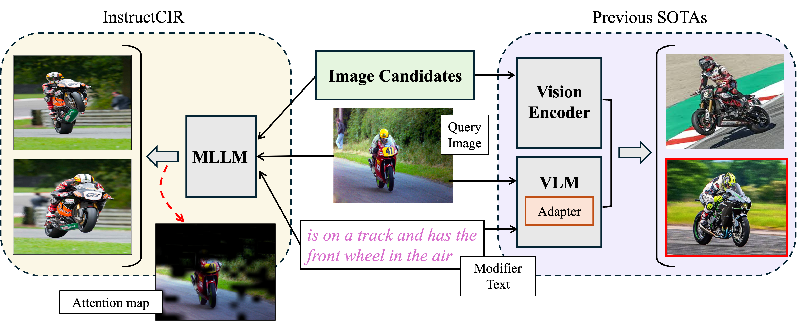

# InstructCIR: Compositional Image Retrieval via Instruction-Aware Contrastive Learning

<span style="font-size: 20px;">Paper: [Compositional Image Retrieval via Instruction-Aware Contrastive Learning](https://arxiv.org/abs/2412.05756)</span>

<div style="text-align: center;">

</div>

## Environment
You will need to create a conda environment (Python 3.10) and install the following dependencies to run the InstructCIR codebase:
```
pip install torch==2.1.2, transformers==4.42.0, datasets==2.20.0, peft==0.10.0, bitsandbytes==0.43.1, accelerate==0.30.1, torchvision==0.16.2, numpy==1.26.4, scikit-learn==1.2.2, requests==2.32.3, timm==0.9.16, einops==0.6.1, einops-exts==0.0.4, deepspeed==0.14.4, ninja==1.11.1.1, wandb==0.16, tqdm==4.66.5, scipy==1.13.0, fire==0.6.0, flash-attn==2.5.7, ipykernel==6.29.3, ipython==8.22.2, Jinja2==3.1.3, matplotlib==3.8.4, openai==1.30.3, opencv-python==4.9.0.80, pandas==2.2.2, tensorboard==2.17.1, tensorboardX==2.6.2.2
```

If you have trouble installing these environments, feel free to open an issue. I will address it ASAP.

## Evaluation
We provide trained checkpoints that can be directly used for evaluation.

### Downloading Datasets
Please follow [this site](https://github.com/miccunifi/SEARLE/tree/main?tab=readme-ov-file#data-preparation) to prepare datasets CIRR, CIRCO, and FashionIQ. Follow [this site](https://github.com/facebookresearch/genecis/blob/main/DOWNLOAD.md) to download GeneCIS.

### Evaluation on CIRR & CIRCO
```
python generate_test_submission.py \
    --submission-name cirr_results \
    --dataset cirr \
    --dataset-path path_to_downloaded_cirr \
    --model_name_or_path uta-smile/instructcir_llava_phi35_clip224_lp
```

```
python generate_test_submission.py \
    --submission-name circo_results \
    --dataset circo \
    --dataset-path path_to_downloaded_circo \
    --model_name_or_path uta-smile/instructcir_llava_phi35_clip224_lp
```

Upon running commands above, results will be saved under `./submission/` as json files. Use [this website](https://cirr.cecs.anu.edu.au/test_process/) for CIRR and [this website](https://circo.micc.unifi.it/evaluation) for CIRCO to submit and obtain evaluation results. This work is involved in another reserach and results may be slightly different from reproted results in the paper due to hyperparameter changes. 

### Evaluation on FashionIQ
Ongoing...

### Evaluation on GeneCIS
Ongoing...

## Training
Ongoing...
